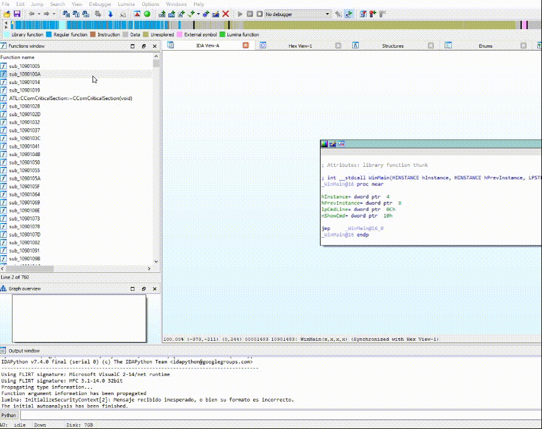

# IDAFunctionsDecompiler

An IDAPython script to decompile all the functions of a binary and dump the pseudocode 

## Table of contents
* [General info](#general-info)
* [Checksums](#checksums)
* [Setup](#setup)
* [Docs](#Docs)

## General info

>- Get the decompiled pseudocode of every function in a binary, using IDA 7.5 and it's API

>- IDAPython plugin and Hexrays decompiler needed! 

## Checksums

gofileUploader.py hashes

>MD5 --> `0c9c5cac57f930e562ce8a053a3237bb`

>Sha1 --> `39d2f3abba612c2e1f09957adba1dcb25c72fd29`

>Sha256 --> `22c64f0f9295f8cd32ed4dfd0ebdb7c7902c341afbc1e60f3bd6097184f9c56b`

## Setup

***Change output path***

`Edit "outputPath" variable from the script, and specify the folder where pseudocode will be stored`

Example:

`outputPath = "C:\\Users\Juanjo\\Desktop\\test"`

## Docs

[IDA API](https://www.hex-rays.com/products/ida/support/idapython_docs/)

[IDA 7.4 Newer API changes](https://www.hex-rays.com/products/ida/support/ida74_idapython_no_bc695_porting_guide.shtml)

